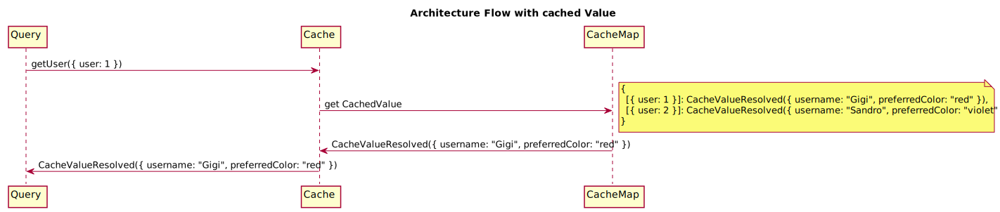

[](https://travis-ci.org/buildo/avenger)
[](https://www.npmjs.com/package/avenger)
[](https://www.npmjs.com/package/avenger)
[](https://david-dm.org/buildo/avenger#info=dependencies&view=list)
[](https://david-dm.org/buildo/avenger#info=devDependencies&view=list)

---

# Intro

Avenger is a data fetching and caching layer written in TypeScript. Its API is designed to mirror the principles of **Command Query Responsibility Segregation** and facilitate their adoption (if you are new to the concept you can get a grasp of its foundations in [this nice article](https://martinfowler.com/bliki/CQRS.html) by Martin Fowler).

Building user interfaces is a complex task, mainly because of its `IO` intensive nature. Reads (**queries**) and updates (**commands**) toward "external" data sources are ubiquitous and difficult to orchestrate, but _orchestration_ is not the only challenge a UI developer faces, _performance_ and _scalability_ are also key aspects of good design.

We believe that an _effective and powerful abstraction to handle caching and synchronization of external data in a declarative way_ is of fundamental importance when designing a solid user interface.

This is what **Avenger** aims to be: an abstraction layer over external data that handles caching and synchronization for you:


By separating how we fetch external data and how we update it we are able to state in a very declarative and _natural_ way the correct lifecycle of that data:

```tsx
// define a cached query, with strategy "available" (more about this later)
const user = queryStrict((id: string) => API.fetchUser(id), available);
// define a command that invalidates the previous query
const updateUsername = command((patch: Partial<User>) => API.updateUser(patch), { user })

// declare it for usage in a React component
const queries = declareQueries({ user });
const Username = queries(props => (
  <div>
    {props.queries.fold(
      () => 'loading...',
      () => 'error while retrieving user',
      queries => (
        <UserNameForm
          value={queries.user.username}
          onSubmit={updateUsername}
        />
      )
    )}
  </div>
));

// render the component
<Username queries={{ user: '42' }} />;
```

# Avenger
At the very heart of Avenger's DSL there are two constructors: **query** and **command**.

## queries
The [**`query`**](#query) function allows you to query your data source and get an object of type [**`CachedQuery`**](#CachedQuery) in return.
It accepts two parameters: the first is a function with a [**`Fetch`**](#Fetch) signature that is used to retrieve data from your data source; the second is an object with the [**`Strategy`**](#Strategy) signature that will be used to decide if the data stored by **Avenger** is still relevant or needs to be refetched.

Although important, `query` is a pretty low-level API and **Avenger** offers some convenient utils with a [**`StrategyBuilder`**](#StrategyBuilder) signature that you should prefer over it (unless you have very specific needs):

- **refetch:** runs the fetch function every time the data is requested (unless there's an ongoing pending request, which is always reused).
- **expire:** when the data is requested, the fetch function is run only if data in the `Cache` is older than the expiration defined, otherwise the cached value is used.
- **available:** when the data is requested, if a cached value is available it is always returned, otherwise the fetch function is run and the result stored in the `Cache` accordingly.

All these utils ask you to pass custom [**`Setoid`**](https://github.com/gcanti/fp-ts/blob/master/docs/modules/Setoid.ts.md) instances as arguments; they will be used to check if a value for an input combination is already present in one of the `Cache`'s keys (if the check is successful `Avenger` will try to use that value, otherwise it will resort to the `Fetch` function).
You can (and should) use these utils together with one of the built-in implementations that automatically take care of passing by the needed `Setoids`:
- **queryShallow:** will use a `Setoid` instance that performs a shallow equality check to compare inputs.
- **queryStrict:** will use a `Setoid` instance that performs a strict equality check to compare inputs.
- **queryJSON:** will use a `Setoid` instance that performs a strict equality check after transforming the data via JSON stringification to compare inputs.

Some examples will help clarify:
```ts
/*
  this implementation will always re-run the `Fetch` function
  even if valid cached data is already present
  and use shallow equality to compare input
*/
const myQuery = queryShallow(fetchFunction, refetch);

/*
  this implementation will never run the `Fetch` function
  unless no valid data is present in the Cache
  and use strict equality to compare input
*/
const myQuery = queryStrict(fetchFunction, available);

/*
  this implementation will run the `Fetch` function only if no valid data is present in the Cache
  or t > 10000 ms passed till the last time data was fetched
  and use JSON equality to compare input
*/
const myQuery = queryJSON(fetchFunction, expire(10000));
```

Each time the `Fetch` function is run with some `input`, those same `input` is used as a `key` to store the result obtained:
```
// usersCache is empty
usersCache: {}

//a user is fetched
getUser({ userId: 1 }) -> { userName: "Mario" }

// usersCache is now populated
usersCache: {
  [{ userId: 1 }]: { userName: Mario }
}
```

From that moment onwards, when **Avenger** will need to decide if the data in our [**`Cache`**](#Cache) is present and still valid it will:

1. attempt to retrieve data from the [**`Cache`**](#Cache)
2. match the result against the cache strategy defined (for instance if we chose `refetch` the data will always be deemed invalid irrespective of the result).

If a valid result is found it is used without further actions, otherwise the `Fetch` function will be re-run in order to get valid data. The two flows are relatively simple:
##### Valid CacheValue


##### Invalid CacheValue
when you call `run` or `subscribe` on a `query` with a combination of `inputs` that was never used before (or whose last use ended up with a `Failure`), avenger will try to run the `Fetch` function resulting in a more complex flow:


## listening to queries
There are two ways to get a query result:

```ts
type Error = "500" | "404";
type User = { userName: String };

declare function getUser(userId: number): TaskEither<Error, User>

const userQuery: CachedQuery<number, Error, User> = query(
  getUser,
)(refetch);

declare function dispatchError(e: Error): void;
declare function setCurrentUser(e: User): void;

// feeding your query to `observe` will give you an observable on the query
// N.B. until now no fetch is yet attempted, avenger will wait until the first subscription is issued
const observable: Observable<QueryResult<Error, User>> = observe(userQuery);

// this will trigger the fetch function
observable.subscribe(dispatchError, setCurrentUser);

// alternatively you can call `run` on your query and it will return a TaskEither<Error, User>
// you can then use it imperatively
const task: TaskEither<Error, User> = userQuery.run(1);
const result: Either<Error, User> = await task.run();
```

although the `run` method is available to check a query result imperatively, it is highly suggested the use of the `observe` utility in order to be notified in real time of when data changes.

Either way, whenever you ask for a query result you will end up with an object with the [**`QueryResult`**](#QueryResult) signature that conveniently lets you `fold` to decide the best way to handle the result. The `fold` method takes three functions as parameters: the first is used to handle a `Loading` result; the second is used in case a `Failure` occurs; the last one handles `Success` values.


## composing queries
You can build bigger queries from smaller ones in two ways:

- by composing them with [**`compose`**](#compose): when you need your queries to be sequentially run with the results of one feeding the other, you can use `compose`.
- by grouping them with [**`product`**](#product): when you don't need to run the queries sequentially but would like to conveniently group them and treat them as if they were one you can use `product`*.

*Internally `product` uses the `Applicative` nature of `QueryResults` to group them using the following hierarchical logic:
  1. If any of the queries returned a `Failure` then the whole composition is a `Failure`.
  2. If any of the queries is `Loading` then the whole composition is `Loading`.
  3. If all the queries ended with a `Success` then the composition is a `Success` with a record of results that mirrors the key/value result of the single queries as value.

Here are a couple of simple examples on how to use them:

```ts
/* N.B. each value defined is explicitly annotated for clarity, although the annotations are not strictly required */

import { compose } from 'avenger/lib/Query';

type UserPreferences = { color: string };

// note that the two ends of the composed functions must have compatible types
declare function getUser(userId: number): TaskEither<Error, User>;
declare function getUserPreferences(
  user: User
): TaskEither<Error, UserPreferences>;

const userQuery: CachedQuery<number, Error, User> = queryStrict(
  getUser,
  refetch
);

const preferencesQuery: CachedQuery<
  User,
  Error,
  UserPreferences
> = queryShallow(getUserPreferences, refetch);

// this is a query composition
const composition: Composition<number, Error, UserPreferences> = compose(
  userQuery,
  preferencesQuery
);

// this is a query product
const group: Product<number, Error, UserPreferences> = product({ myQuery, myQuery2 });
```


# commands
Up to now we only described how to fetch data. When you need to update or insert data remotely you can make use of [**`command`**](#command):

```ts
declare function updateUserPreferences({
  color: string
}): TaskEither<Error, void>;

const updatePreferencesCommand = command(updateUserPreferences, {
  preferencesQuery
});
```

`command` accepts a `Fetch` function that will be used to modify the remote data source and, as a second optional parameter, a record of `query`es that will be invalidated once the `command` is successfully run:

```ts
/* when you call the command you can specify the input value corresponding
to the Cache key that should be invalidated as a second parameter */
updatePreferencesCommand({ color: 'acquamarine' }, { preferencesQuery: 1 });
```

# React

Avenger also exports some utilities to use with `React`.

## declareQueries

`declareQueries` is a `HOC` (Higher-Order Component) builder. It lets you define the queries that you want to inject into a component and then creates a simple `HOC` to wrap it:

```tsx
import { declareQueries } from 'avenger/lib/react';
import { userPreferences } from './queries';

const queries = declareQueries({ userPreferences });

class MyComponent extends React.PureComponent<Props, State> {
  render() {
    return this.props.queries.fold(
      () => <p>loading</p>,
      () => <p>there was a problem when fetching preferences</p>,
      ({ userPreferences }) => <p>my favourite color is {userPreferences.color}</p>
    )
  }
}

export queries(MyComponent)
```

When using this component from outside you will have to pass it the correct query parameters inside the `queries` prop in order for it to load the declared queries:

```ts
class MyOtherComponent extends React.PureComponent<Props, State> {
  render() {
    return (
      <MyComponent
        queries={{
          userPreferences: { userName: 'Mario' }
        }}
      />
    );
  }
}
```

## WithQuery

alternatively, to avoid unecessary boilerplate, you can use the `WithQuery` component:

```tsx
import { WithQuery } from 'avenger/lib/react';
import { userPreferences } from './queries'

class MyComponent extends React.PureComponent<Props, State> {
  render() {
    return (
      <WithQuery
        query={userPreferences},
        input={{ userName: 'Mario' }}
        render={userPreferences => userPreferences.fold(
          () => <p>loading</p>,
          () => <p>there was a problem when fetching preferences</p>,
          (userPreferences) => <p>my favourite color is {userPreferences.color}</p>
        )}
      />
    )
  }
}
```

# Navigation

Another useful set of utilities is the one used to handle client navigation in the browser. Following you can find a simple but exhaustive example of how it is used:

```ts
import { getCurrentView, getDoUpdateCurrentView } from "avenger/lib/browser";

export type CurrentView =
  | { view: 'itemView'; itemId: String }
  | { view: 'items' };
  | { view: 'home' };

const itemViewRegex = /^\/items\/([^\/]+)$/;
const itemsRegex = /^\/items$/;

export function locationToView(location: HistoryLocation): CurrentView {
  const itemViewMatch = location.pathname.match(itemViewRegex);
  const itemsMatch = location.pathname.match(itemsRegex);

  if (itemViewMatch) {
    return { view: 'itemView'; itemId: itemViewMatch[1] };
  } else if (itemsMatch) {
    return { view: 'items' };
  } else {
    return { view: 'home' };
  }
}

export function viewToLocation(view: CurrentView): HistoryLocation {
  switch (view.view) {
    case 'itemView':
      return { pathname: `/items/${view.itemId}`, search: {} };
    case 'items':
      return { pathname: '/items', search: {} };
    case 'home':
      return { pathname: '/home', search: {} };
  }
}

const currentView: ObservableQuery = getCurrentView(locationToView);
export const doUpdateCurrentView: Command = getDoUpdateCurrentView(viewToLocation);
```

once you instantiated all the boilerplate needed to instruct Avenger on how to navigate, you can use `currentView` and `doUpdateCurrentView` like they were normal queries and commands (and, in fact, they are..).

```tsx
// ./App.ts

import { declareQueries } from 'avenger/lib/react';

const queries = declareQueries({ currentView });

// usually at the top level of your app there will be a sort of index of your navigation
class Navigation extends React.PureComponent<Props, State> {
  render() {
    return this.props.queries.fold(
      () => <p>loading</p>,
      () => null,
      ({ currentView }) => {
        switch(currentView.view) {
          case 'itemView':
            return <ItemView id={view.itemId} />
          case 'items':
            return <Items />
          case 'home':
            return <Home />
        }
      }
    )
  }
}

export queries(MyComponent)
```
```tsx
// ./Components/ItemView.ts

class ItemView extends React.PureComponent<Props, State> {
  goToItems: () => doUpdateCurrentView({ view: 'items' }).run()

  render() {
    return <BackButton onClick={this.goToItems}>
  }
}
```

## Signatures

> N.B. all the following signatures reference the abstractions in [`fp-ts`](https://github.com/gcanti/fp-ts)

### `query`
```ts
declare function query<A = void, L = unknown, P = unknown>(
  fetch: Fetch<A, L, P>
): (strategy: Strategy<A, L, P>) => CachedQuery<A, L, P>
```

### `Fetch`

```ts
type Fetch<A, L, P> = (input: A) => TaskEither<L, P>;
```

### `StrategyBuilder`

```ts
type StrategyBuilder<A, L, P> = (
  inputSetoid: Setoid<A>,
  cacheValueSetoid: Setoid<CacheValue<L, P>>
) => Strategy<A, L, P>;
```

### `Strategy`

```ts
export class Strategy<A, L, P> {
  constructor(
    readonly inputSetoid: Setoid<A>,
    readonly filter: Function1<CacheValue<L, P>, boolean>,
    readonly cacheValueSetoid: Setoid<CacheValue<L, P>>
  ) {}
}
```

### `CachedQuery`

```ts
interface CachedQuery<A, L, P> {
  type: 'cached';
  inputSetoid: Setoid<A>;
  run: Fetch<A, L, P>;
  invalidate: Fetch<A, L, P>;
  cache: Cache<A, L, P>;
}
```

### `Composition`

```ts
interface Composition<A, L, P> {
  type: 'composition';
  inputSetoid: Setoid<A>;
  run: Fetch<A, L, P>;
  invalidate: Fetch<A, L, P>;
  master: ObservableQuery<A, L, unknown>;
  slave: ObservableQuery<unknown, L, P>;
}
```

### `Product`

```ts
interface Product<A, L, P> {
  type: 'product';
  inputSetoid: Setoid<A>;
  run: Fetch<A, L, P>;
  invalidate: Fetch<A, L, P>;
  queries: Record<string, ObservableQuery<A[keyof A], L, P[keyof P]>>;
}
```

### `ObservableQuery`

```ts
type ObservableQuery<A, L, P> =
  | CachedQuery<A, L, P>
  | Composition<A, L, P>
  | Product<A, L, P>;
```

### `QueryResult`

```ts
// instance of Bifunctor2<URI> & Monad2<URI>
type QueryResult<L, A> = Loading<L, A> | Failure<L, A> | Success<L, A>;
```

### `compose`

```ts
function compose<A1, L1, P1, L2, P2>(
  master: ObservableQuery<A1, L1, P1>,
  slave: ObservableQuery<P1, L2, P2>
): Composition<A1, L1 | L2, P2>
```

### `product`

```ts
function product<R extends ObservableQueries>(
  queries: EnforceNonEmptyRecord<R>
): Product<ProductA<R>, ProductL<R>, ProductP<R>>
```

### `command`

```ts
function command<A, L, P, I extends ObservableQueries, IL extends ProductL<I>>(
  cmd: Fetch<A, L, P>,
  queries?: EnforceNonEmptyRecord<I>
): (a: A, ia?: ProductA<I>) => TaskEither<L | IL, P>;
```
